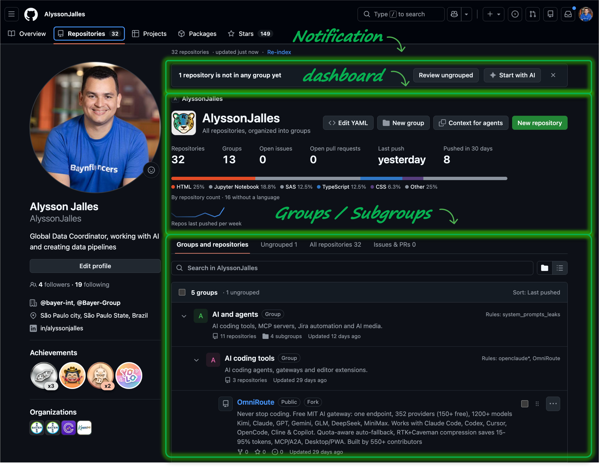
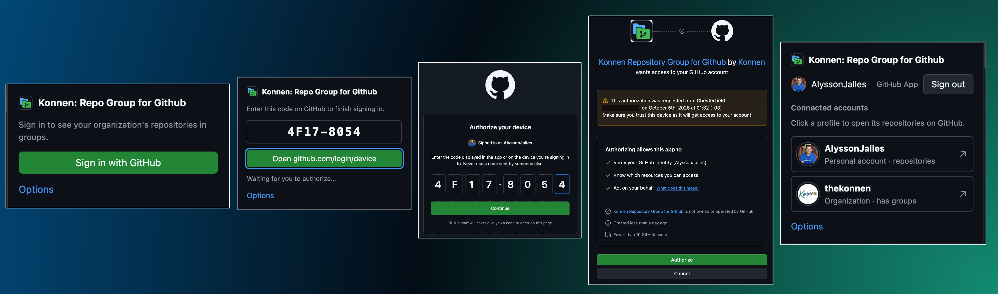

### Konnen: Repo group for GitHub

Organizes the repositories of a GitHub organization or personal account into nested groups and subgroups, directly on github.com.  

This solves a request to the official GitHub Team: https://github.com/orgs/community/discussions/41348 (Create groups of repositories #41348)

_groups in a personal profile_


_groups in a organization_


## Install

You need the GitHub App and the extension. Chrome, Edge and Brave users can install it from the [Chrome Web Store](https://chromewebstore.google.com/detail/bfoacibbggpnlofmimdpmaffhnejmlfd); the steps below build it from source instead.

### 1. Install the GitHub App

Open **https://github.com/apps/konnen-repository-group-for-github/installations/new**, choose your account or organization, select **All repositories** and click **Install**.

- Organization: an org owner has to do this once. If you are not an owner, send them the link.
- Personal profile: choose your own account.

### 2. Install the extension (Chrome, Edge, Brave)

**From the chrome store:** [Add to Chrome](https://chromewebstore.google.com/detail/bfoacibbggpnlofmimdpmaffhnejmlfd).

<details>
<summary><b>From source</b> (developer mode)</summary>

```sh
git clone https://github.com/thekonnen/repo-group-for-github.git
cd repo-group-for-github
npm install
npm run build
```

1. Open `chrome://extensions` (`edge://extensions` in Edge, `brave://extensions` in Brave).
2. Turn on **Developer mode**.
3. Click **Load unpacked** and select the `.output/chrome-mv3` folder.

Firefox: run `npm run build:firefox`, open `about:debugging#/runtime/this-firefox`, click **Load Temporary Add-on** and select `.output/firefox-mv3/manifest.json`. Firefox removes it when it closes.

After you pull new changes, run `npm run build` again and click the reload icon on the extension.

</details>

### 3. Sign in

Click the extension icon, then **Sign in with GitHub**. Copy the code, authorize on GitHub, and open one of the pages below.



## Where it works

| Page | URL |
|---|---|
| Organization | `https://github.com/orgs/<org>/repositories` |
| Personal profile (your own, signed in) | `https://github.com/<username>?tab=repositories` |
| Team | `https://github.com/orgs/<org>/teams/<slug>/repositories` |

On an organization, groups are shared through `repo-groups.yml` in the org's `.github` repository. On your personal profile, groups are yours alone and stay in your browser (**My groups**). On someone else's profile the extension does nothing.

### features compared to https://github.com/orgs/community/discussions/41348 Create groups of repositories #41348

**GitHub has had a request open for this since 2022: 159 comments, 590+ votes, no answer. Repository Group for Github ships it today.** GitLab-style groups, built into the github.com you already use, with no server and nothing to migrate. No waiting for the "agentic era" roadmap either: the $\color{#8250df}{\textbf{AI}}$ is already in the box, from sorting hundreds of repos in one paste to agents that keep the tree tidy.

| Feature people ask for in the thread | GitHub today | Konnen: Repo Group for Github |
|---|:---:|:---:|
| **Group repositories into categories** to declutter the list | ❌ | ✅ Grouped view opens by default, one click back to GitHub's list |
| **Nested groups and subgroups, like GitLab** (`infra / dagu / dagsrv`) | ❌ | ✅ Any depth, breadcrumbs, a page and a URL per group |
| **No extra organizations** just to group repos (billing, access and policies stay in one place) | ❌ | ✅ Everything stays inside your org |
| **Shared with the whole team** | ❌ | ✅ Versioned in `<org>/.github/repo-groups.yml`, same tree for every member |
| **Private groups just for me** (GitHub Lists are public) | ❌ | ✅ **My groups**, synced across your browsers, never published |
| **Groups on a personal account**, no org needed | ❌ | ✅ Works on your own profile |
| **Repos that file themselves** (`dags-*`) | ❌ | ✅ Name patterns, exact names, deepest group wins |
| **Group by topics** | ⚠️ search only | ✅ `topic:ml-*` rules, shown as a real tree |
| **Group by custom properties** | ⚠️ search only | ✅ `prop:client=Acme` rules |
| **A repo in more than one group** | ❌ | ✅ `shared:` rules and **Also list in…** |
| **Forks grouped by upstream** | ❌ | ✅ `fork-of:` rules and **Auto-group forks** |
| **Give a group's repos to a team** | ❌ | ✅ Teams on groups, inherited by subgroups, **Sync access** in one click (adds, never removes) |
| **Team pages organized the same way** | ❌ | ✅ Only that team's repos, in your group tree, with its permission on each row |
| **Group-level README, issues and PRs, stats** | ❌ | ✅ Group README, aggregated open issues and PRs, stars, languages, activity charts |
| **Group-level defaults** (labels, milestones) | ❌ | ✅ Inherited by subgroups, **Sync labels** is add-only |
| **Who has access to a group** | ❌ | ✅ Members via inherited teams |
| **Hundreds or thousands of repos** | ⚠️ one long list | ✅ Local index, usually 1 request to refresh, virtualized lists, optional prebuilt index Action |
| **Move repos like folders** | ❌ | ✅ Menu, drag and drop, bulk, with a confirmation before the commit |
| **Works for members who are not admins** | ❌ | ✅ Sees only what they can open, organizes in My groups, **Suggest change** opens GitHub's "Propose changes" |
| **Group logos** | ❌ | ✅ Upload, paste or link, with a cropper |
| **Organize with $\color{#8250df}{\textbf{AI}}$** | ❌ | ✅ **Your whole org sorted in minutes.** Copy the prompt and the repo list, paste any $\color{#8250df}{\textbf{AI}}$ chat answer back, review the diff, commit. Works with ChatGPT, Claude, Gemini or any model |
| **$\color{#8250df}{\textbf{AI}}$ picks the group for a new repo** | ❌ | ✅ Name and describe it, and the $\color{#8250df}{\textbf{AI}}$ suggests where it belongs. Gemini, Anthropic or any OpenAI-compatible key, with a free keyword fallback. Off until you add a key |
| **$\color{#8250df}{\textbf{AI}}$ agents can organize your repos** | ❌ | ✅ Give Claude Code, Cursor or any $\color{#8250df}{\textbf{AI}}$ agent the context of a group and let it work on your tree |
| **MCP server** (Model Context Protocol) | ❌ | ✅ **`rg mcp` turns your org into tools any MCP client can call:** `list_groups`, `list_repos`, `show_group`, `suggest`, `move_repo`, `add_rule`, `create_group`, `validate`, `diff`, `apply`. Writes are a dry run until the agent passes `apply: true`, so nothing is committed by accident |
| **CLI for scripts and CI** | ❌ | ✅ `rg list-groups`, `suggest`, `move-repo`, `add-rule`, `diff`, `apply`. Same placement and validation code as the extension, dry run by default, `--yes` to commit |
| **Scheduled reorganization** | ❌ | ✅ A scheduled Action opens a PR proposing new groups, so the tree keeps up with the org while you review |
| **Light, dark and dimmed themes** | n/a | ✅ Reads GitHub's own theme |
| **No server, no database, no analytics** | n/a | ✅ Your data stays in GitHub and in your browser |
| **Chrome, Edge, Brave and Firefox** | n/a | ✅ One small extension |

⚠️ = GitHub offers a partial workaround. Topics and custom properties are not replaced: they become group rules. Teams become group access.

**Built for the $\color{#8250df}{\textbf{AI}}$ era:** other tools make you organize by hand. Here the $\color{#8250df}{\textbf{AI}}$ does the sorting, you approve the diff and every change is a reviewable commit.

**Why install it:** the people in that thread have been told to create more organizations, rename repos and wait. You can have the GitLab-style tree on your next page load.
