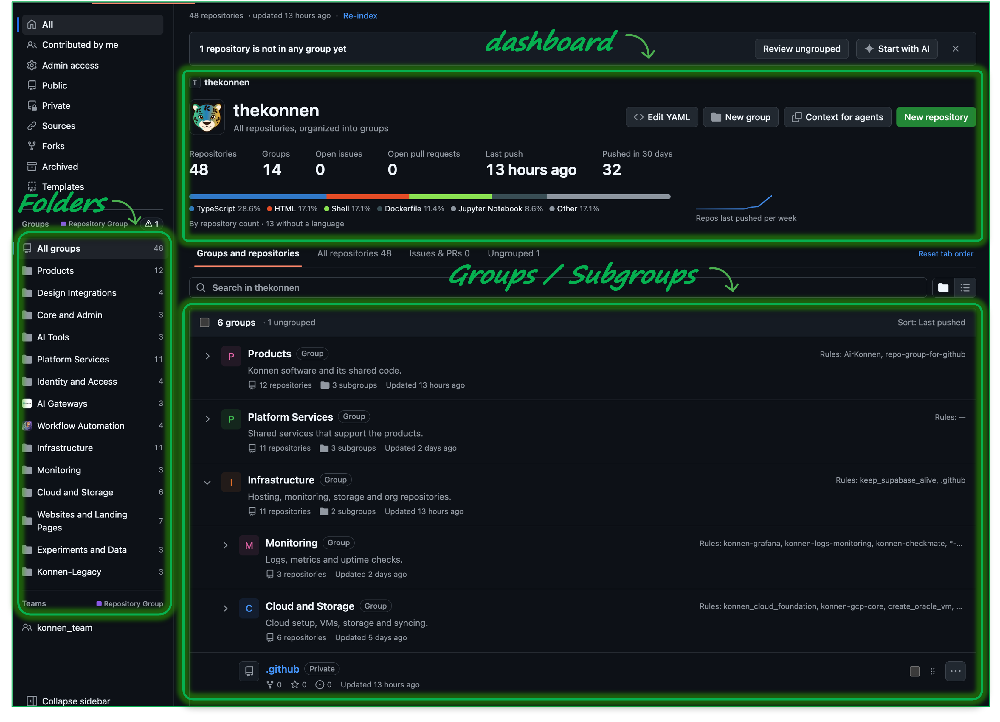

### Title



## Install

The extension is not on the Chrome Web Store yet, so you load it in developer mode. You need the GitHub App and the extension.

### 1. Install the GitHub App

Open **https://github.com/apps/konnen-repository-group-for-github/installations/new**, choose your account or organization, select **All repositories** and click **Install**.

- Organization: an org owner has to do this once. If you are not an owner, send them the link.
- Personal profile: choose your own account.

### 2. Install the extension (Chrome, Edge, Brave)

```sh
git clone https://github.com/thekonnen/repo-group-for-github.git
cd repo-group-for-github
npm install
npm run build
```

1. Open `chrome://extensions` (`edge://extensions` in Edge, `brave://extensions` in Brave).
2. Turn on **Developer mode**.
3. Click **Load unpacked** and select the `.output/chrome-mv3` folder.

Firefox: run `npm run build:firefox`, open `about:debugging#/runtime/this-firefox`, click **Load Temporary Add-on** and select `.output/firefox-mv3/manifest.json`. Firefox removes it when it closes.

After you pull new changes, run `npm run build` again and click the reload icon on the extension.

### 3. Sign in

Click the extension icon, then **Sign in with GitHub**. Copy the code, authorize on GitHub, and open one of the pages below.

## Where it works

| Page | URL |
|---|---|
| Organization | `https://github.com/orgs/<org>/repositories` |
| Personal profile (your own, signed in) | `https://github.com/<username>?tab=repositories` |
| Team | `https://github.com/orgs/<org>/teams/<slug>/repositories` |

On an organization, groups are shared through `repo-groups.yml` in the org's `.github` repository. On your personal profile, groups are yours alone and stay in your browser (**My groups**). On someone else's profile the extension does nothing.
